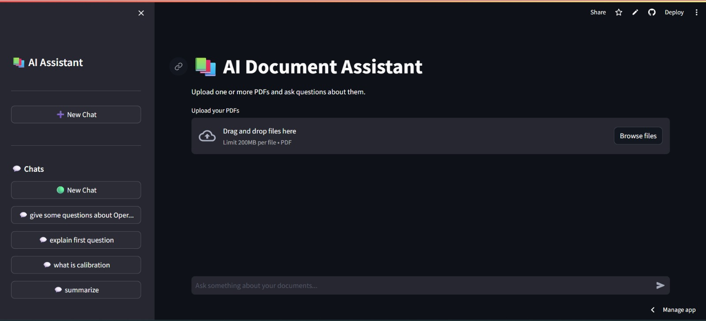
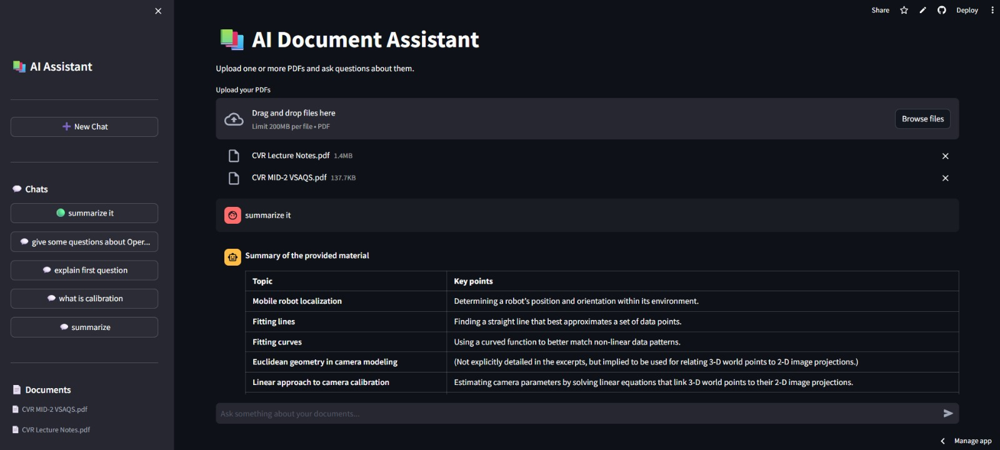

# RAG Chatbot - AI Document Assistant

A conversational document analysis tool powered by Retrieval-Augmented Generation (RAG). Upload PDF documents and ask natural language questions about their content. The system maintains chat history across multiple sessions and provides source attribution for all answers.

## 🎯 Project Overview

RAG Chatbot is a Streamlit-based web application that enables users to:
- Upload PDF documents to independent chat sessions
- Ask questions about document content in natural language
- Receive AI-generated answers grounded in the documents
- Track chat conversations with persistent history
- Access source attribution (document name and page number) for each answer

The application uses semantic search powered by Pinecone vector embeddings and the Groq language model for answer generation, ensuring responses are based solely on uploaded document content.

## ✨ Features

- **Multi-Document Upload**: Upload multiple PDFs per chat session for unified querying
- **Semantic Search**: Find relevant document sections using vector similarity (top 5 results)
- **Context-Aware Q&A**: Understands follow-up questions using conversation history
- **Question Rewriting**: Converts contextual follow-up questions to standalone queries
- **Source Attribution**: Every answer includes document name and page number reference
- **Chat Sessions**: Create and manage multiple independent conversations
- **Chat History**: Full message history persisted in SQLite database
- **Auto-Titling**: Automatically generates chat titles from the first user question
- **Document Metadata**: Tracks file size, page count, and chunk count for each document
- **Progress Tracking**: Real-time progress feedback during PDF processing

## 🏗️ Architecture & Workflow

### Processing Pipeline

```
1. PDF Upload
   ↓
2. PDF Text Extraction (PyPDFLoader)
   ↓
3. Document Chunking (RecursiveCharacterTextSplitter: 800 chars, 100 overlap)
   ↓
4. Embedding Generation (Sentence Transformers: all-MiniLM-L6-v2)
   ↓
5. Vector Storage (Pinecone with namespace isolation per chat)
   ↓
6. User Question → Question Rewriting (Groq LLM)
   ↓
7. Semantic Search (Pinecone retriever: k=5)
   ↓
8. Answer Generation (Groq LLM with retrieved context & chat history)
   ↓
9. Response + Source Attribution
```
## 📸 Preview
### Home Page


### Chat Conversation


### Key Components

**Document Processing** (`ingest.py`):
- Loads PDF files and extracts pages
- Splits content into 800-character chunks with 100-character overlap
- Generates embeddings in batches (64 documents per batch)
- Uploads vectors to Pinecone in batches (100 vectors per batch)
- Tracks processing progress and returns page/chunk counts

**RAG Chain** (`rag_chain.py`):
- Question Rewriting: Uses LLM to convert follow-up questions into standalone queries
- Semantic Retrieval: Searches Pinecone vectors using cosine similarity
- Answer Generation: Generates answers using Groq LLM with:
  - System rules ensuring document-only reasoning
  - Chat history for context
  - Retrieved document sections as context
- Source Extraction: Deduplicates and formats sources with page numbers

**Data Storage** (`database.py`):
- SQLite database with three core tables:
  - `chats`: Chat sessions (chat_id, title, namespace, timestamps)
  - `messages`: Conversation history (chat_id, role, content, timestamp)
  - `documents`: File metadata (chat_id, filename, size, pages, chunks)
- Namespace-based isolation: Each chat uses a separate Pinecone namespace

**User Interface** (`streamlit_app.py`):
- Sidebar navigation for chat history and document listing
- File upload with progress tracking
- Real-time chat interface with message history
- Source citations displayed below each answer
- Clear chat functionality

## 🛠️ Technologies

| Component | Technology | Version |
|-----------|-----------|---------|
| **Frontend** | Streamlit | 1.32.2 |
| **LLM Framework** | LangChain | 0.1.16 |
| **Language Model** | Groq (openai/gpt-oss-20b) | - |
| **Embeddings** | Sentence Transformers | 5.7.0 |
| **Vector Database** | Pinecone | 3.2.2 |
| **PDF Processing** | PyPDF | 4.2.0 |
| **Text Splitting** | LangChain | 0.1.16 |
| **Local Database** | SQLite | - |
| **Runtime** | Python | 3.11.9 |

## 📁 Project Structure

```
RAGCHATBOT/
├── streamlit_app.py          # Main application (UI, chat logic, file uploads)
├── rag_chain.py              # RAG pipeline (question rewriting, retrieval, answer generation)
├── ingest.py                 # Document processing (PDF loading, chunking, embedding)
├── database.py               # SQLite operations (chats, messages, documents)
├── config.py                 # Secrets configuration (for deployment)
├── requirements.txt          # Python dependencies
├── runtime.txt               # Python version (3.11.9)
├── chat_history.db           # SQLite database (created at runtime)
├── data/                     # Directory for document storage (if applicable)
└── README.md                 # This file
```

## 📋 Requirements

- **Python**: 3.11.9
- **API Keys**:
  - `PINECONE_API_KEY` - Vector database access token
  - `PINECONE_INDEX` - Pinecone index name (must be pre-created)
  - `GROQ_API_KEY` - Language model API key

## 🔧 Installation & Setup

### 1. Clone or Download the Repository

```bash
cd path/to/RAGCHATBOT
```

### 2. Create Virtual Environment

```bash
python -m venv .venv
```

### 3. Activate Virtual Environment

**Windows:**
```bash
.venv\Scripts\activate
```

**macOS/Linux:**
```bash
source .venv/bin/activate
```

### 4. Install Dependencies

```bash
pip install -r requirements.txt
```

### 5. Configure Environment Variables

**Option A: Using `.env` file (Development)**

Create `.env` in the project root:
```env
PINECONE_API_KEY=your_api_key_here
PINECONE_INDEX=your_index_name
GROQ_API_KEY=your_groq_key_here
```

**Option B: Using Streamlit Secrets (Deployment)**

Create `.streamlit/secrets.toml`:
```toml
PINECONE_API_KEY = "your_api_key_here"
PINECONE_INDEX = "your_index_name"
GROQ_API_KEY = "your_groq_key_here"
```

## 🚀 Running the Application

```bash
streamlit run streamlit_app.py
```

The application will launch at `http://localhost:8501` in your default browser.

## 💾 Environment Variables

All environment variables are required for the application to function:

| Variable | Description | Source |
|----------|-------------|--------|
| `PINECONE_API_KEY` | API key for Pinecone vector database | From Pinecone dashboard |
| `PINECONE_INDEX` | Name of your Pinecone index | Pre-configured in Pinecone |
| `GROQ_API_KEY` | API key for Groq language models | From Groq console |

## 📄 Supported Document Types

- **PDF (`.pdf`)** - The only supported format

PDF files are processed using PyPDFLoader, which extracts text from all pages.

## 🎮 How to Use

### Starting a Chat
1. Open the application at `http://localhost:8501`
2. By default, a "New Chat" session is created automatically
3. Upload PDF documents using the file uploader on the main page

### Uploading Documents
1. Click the "Upload your PDFs" button
2. Select one or more PDF files
3. Processing begins automatically with progress tracking:
   - Reading PDF
   - Splitting content
   - Generating embeddings
   - Uploading to Pinecone
4. Uploaded documents are listed in the sidebar under "Documents"

### Asking Questions
1. Type your question in the chat input box at the bottom
2. The system must have at least one document uploaded to respond
3. The assistant:
   - Rewrites your question for context clarity
   - Searches the document embeddings
   - Generates an answer based only on document content
   - Provides source citations (document name + page number)

### Managing Conversations
- **New Chat**: Click "➕ New Chat" to create an independent conversation
- **Switch Chats**: Click any chat title in the sidebar
- **Clear Chat**: Click "🗑️ Clear Current Chat" to delete message history (documents remain)
- **Chat Titles**: Auto-generated from your first question (first 30 characters)

## 🔬 How It Works

### Question Processing
1. **Question Rewriting**: The system rewrites follow-up questions to standalone queries using conversation history. For example:
   - Input: "Explain more"
   - Context: Previous question was "What is AI?"
   - Rewritten: "Explain more about AI in depth"

2. **Semantic Search**: The rewritten question is embedded and compared against document embeddings using cosine similarity. The top 5 most relevant chunks are retrieved.

3. **Answer Generation**: The Groq LLM generates an answer using:
   - Retrieved document context
   - Full conversation history
   - System rules enforcing document-based reasoning only

4. **Source Attribution**: Sources are extracted from retrieved chunks, deduplicated, and presented with page numbers.

### Constraints & Safety
The system enforces these rules via the system prompt:
- Use only provided document content
- Do NOT use outside knowledge
- Decline to answer if information not in documents
- Do not invent information
- Provide detailed answers only when requested

## 🗄️ Database Schema

### `chats` Table
```sql
chat_id TEXT PRIMARY KEY
title TEXT
namespace TEXT
created_at TEXT
updated_at TEXT
```

### `messages` Table
```sql
id INTEGER PRIMARY KEY
chat_id TEXT (FOREIGN KEY)
role TEXT (user | assistant)
content TEXT
created_at TEXT
```

### `documents` Table
```sql
id INTEGER PRIMARY KEY
chat_id TEXT (FOREIGN KEY)
filename TEXT
file_size INTEGER
pages INTEGER
chunks INTEGER
uploaded_at TEXT
```

## 🔐 Security

**Recommendations:**
- Store `.env` files locally and never commit to version control
- Use Streamlit secrets for production deployments
- Ensure Pinecone index has appropriate access controls
- Keep API keys secure and rotate periodically
- Add `.env` and `.streamlit/secrets.toml` to `.gitignore`

## 🚨 Troubleshooting

### PDF Upload Fails
- Ensure the PDF is not corrupted
- Verify the PDF contains extractable text
- Check that the file is actually a valid PDF format

### No Answer Generated
- Confirm at least one document is uploaded
- Verify Pinecone namespace is correctly configured
- Check that API keys are valid

### Slow Response Times
- Verify network connectivity to Pinecone and Groq
- Check Pinecone index status
- Monitor API rate limits

### "No readable text found" Error
- The PDF may be image-based (scanned documents)
- Try converting the PDF to text-extractable format

## 🔮 Future Enhancements

- [ ] Support for additional document formats (DOCX, TXT, EPUB)
- [ ] OCR support for scanned PDFs
- [ ] Document summarization feature
- [ ] Export chat history as PDF/JSON
- [ ] Multi-language support and translation
- [ ] Configurable embedding and LLM models
- [ ] Document search and filtering
- [ ] Citation export in various formats (APA, MLA, etc.)
- [ ] Batch document processing
- [ ] Document comparison across files

## 📚 Dependencies

See `requirements.txt` for the complete list. Key packages:
- `streamlit==1.32.2` - Web UI framework
- `langchain==0.1.16` - LLM orchestration
- `langchain-groq==0.1.5` - Groq integration
- `langchain-pinecone==0.1.2` - Pinecone integration
- `pinecone-client==3.2.2` - Vector DB client
- `sentence-transformers==5.7.0` - Embedding model
- `pypdf==4.2.0` - PDF processing
- `python-dotenv==1.0.1` - Environment management

---

**Built with LangChain • Pinecone • Groq • Streamlit**
